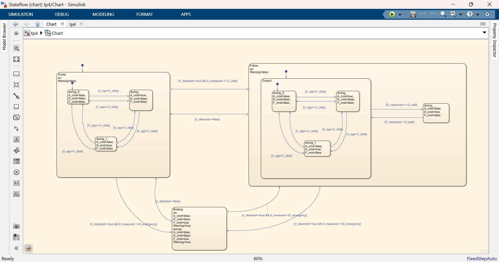
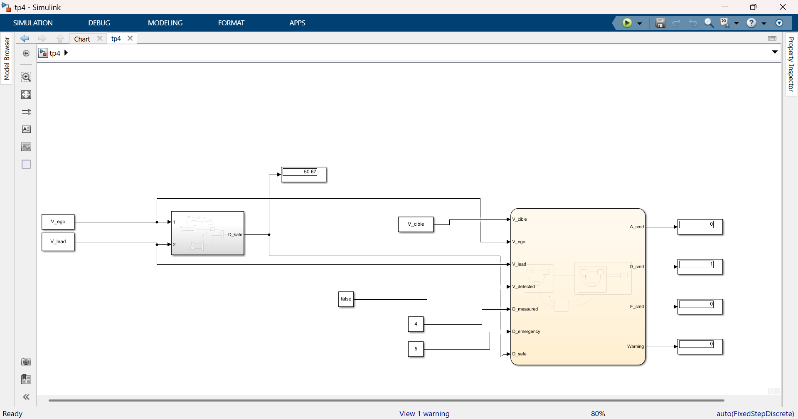

# Portfolio – FATIMA EZZAHRAE EL ANSARI
Ingénieure en Électronique Embarquée et Systèmes Intelligents
Projets en systèmes automobiles (ADAS), robotique et conception de circuits intégrés —Cadence Virtuoso, MATLAB/Simulink

## 🏭 Stage Holcim Maroc – Modélisation et maintenance prédictive du broyeur BK4
Modélisation du broyeur BK4 sous MATLAB/Simulink, capteurs virtuels, et modèle IA (Random Forest) 
de prédiction de l'état de fonctionnement (sain / défaut faible / défaut grave).

## 🚁 Simulation d'un Quadrirotor (MATLAB/Simulink)
Modélisation et contrôle d’un quadrirotor avec régulateurs PID et simulation de ses performances.

## 🚦 Système de Feux Tricolores – Stateflow
Modélisation et validation d’un système de feux de circulation en temps réel via les tests MIL, SIL, PIL et HIL.

## 🚗 Adaptive Cruise Control (ACC) – MATLAB/Simulink & Stateflow

Dans le cadre d'un projet de modélisation des systèmes automobiles, j'ai réalisé la conception d'un système
Adaptive Cruise Control (ACC) permettant d'adapter automatiquement la vitesse du véhicule en fonction de la
présence d'un véhicule précédent et de la distance de sécurité.

La logique de fonctionnement a été implémentée avec Stateflow à travers trois états principaux : **Cruise**,
**Follow** et **Braking**.

- **Cruise** : en l'absence de véhicule détecté, le système maintient la vitesse cible définie par le conducteur.
- **Follow** : lorsqu'un véhicule est détecté, le système ajuste la vitesse afin de respecter la distance de sécurité.
- **Braking** : lorsque la distance devient critique, le système déclenche un freinage d'urgence accompagné d'une alerte.

Les transitions entre les différents états sont définies à partir de conditions telles que la détection d'un
véhicule, la vitesse du véhicule ego et la distance mesurée. Cette approche permet de représenter clairement le
comportement dynamique et décisionnel de l'ACC avant son intégration dans le modèle Simulink.

Une fois la logique validée en simulation, un test **HIL (Hardware-in-the-Loop)** a été réalisé sur carte
**Pixhawk 2.4.8**,  afin de vérifier le comportement du code généré directement sur la cible embarquée. L'état actif du système (Cruise / Follow / Braking) est restitué par la
configuration d'une LED sur la carte.

🛠️ Outils utilisés : MATLAB | Simulink | Stateflow | Model-Based Design | Test HIL (Pixhawk 2.4.8)

## 🔌 Conception de circuits intégrés – Cadence Virtuoso 180nm
Simulation de circuits au niveau transistor, incluant amplificateurs opérationnels, miroirs de courant et portes
logiques numériques (NAND, XOR, inverseurs) avec la technologie Cadence 180nm, vérification DRC/LVS.

## 🔋 Système de gestion de batterie (BMS) – Véhicule électrique
Modélisation et analyse dynamique d'une batterie lithium-ion.

## 🤖 Robot suiveur de ligne STM32
Robot autonome, suivi de ligne et détection d'obstacles en temps réel.
